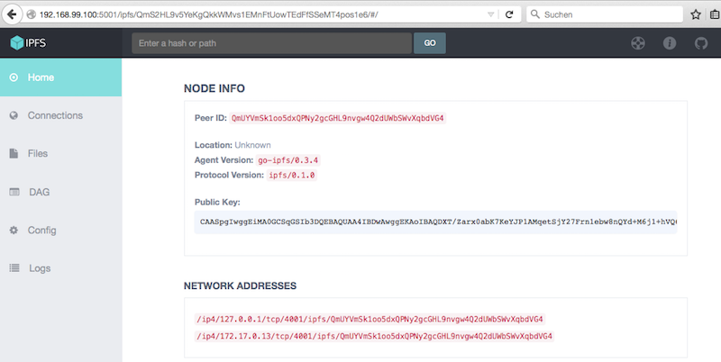
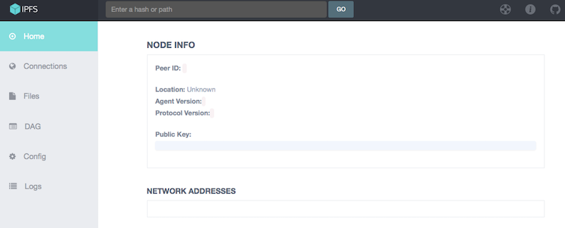

# docker-ipfs

Docker Image holding the IPFS peer2peer filesystem

## IPFS Hello World
Following the Tutorial on the [ipfs website](http://ipfs.io/docs/getting-started/) a hello world comes down to the following.

#### Start stack

```
$ docker-compose up -d
Creating dockeripfs_consul_1...
Creating dockeripfs_ipfs0_1...
Creating dockeripfs_ipfs1_1...
```

After a couple of seconds the WebUI is accessible under `<docker_host>:5001/webui/` which will be forwarded to `<docker_host>:5001/ipfs/<hash_of_the_node>`.


Master is using the ipfs-version `0.3.5` (which identifies itself as `0.3.4` - [https://github.com/ipfs/go-ipfs/issues/1810](https://github.com/ipfs/go-ipfs/issues/1810)).

Higher version do not work as expected since, they do not provide NODE INFO.

```
docker-ipfs (master) $ git checkout 0.3.6
docker-ipfs (0.3.6) $ docker-compose up -d
Creating dockeripfs_consul_1...
Creating dockeripfs_ipfs0_1...
Creating dockeripfs_ipfs1_1...
```

Results in:


